# aiup-alfresco

A [Claude Code](https://claude.com/claude-code) plugin and portable prompt pack for Alfresco extension development. It packages the workflow as command specs, skills, and agents so the same repository guidance can be reused from Claude, Cursor, Codex, OpenClaw, or another coding agent.

AIUP (AI Unified Process) is a spec-driven approach to AI-assisted development. This project applies AIUP principles to Alfresco extensions.

> If this project keeps expanding in scope and quality, it may eventually supersede the guidance currently collected in [alfresco-developer-series](https://github.com/aborroy/alfresco-developer-series).

## Prerequisites

- Java 17+
- Maven 3.9+
- Docker & Docker Compose
- [Claude Code](https://claude.com/claude-code) CLI installed and configured if you want native slash commands

## Installation

```bash
claude plugin install aborroy/aiup-alfresco
```

Or for local development:

```bash
claude --plugin-dir /path/to/aiup-alfresco
```

If you are using Codex, OpenClaw, or another agent, installation is optional; you can use the portable renderer below directly from the repository checkout.

### Cursor

1. Clone this repository and open it as the workspace root in Cursor (2.4+).
2. Project rules (`.cursor/rules/aiup-alfresco.mdc`) and skills (`.cursor/skills/`) load automatically.
3. In Agent chat, type **`/requirements`**, **`/scaffold`**, etc. to run AIUP workflow steps.
4. Optional: enable **Hooks** in Cursor settings; ensure `.cursor/hooks/*.sh` are executable.
5. After editing `skills/`, `agents/`, or `commands/`, regenerate Cursor skills: `./scripts/build-cursor-skills.sh`
6. In another Alfresco project: submodule at `tools/aiup-alfresco/` and run `./tools/aiup-alfresco/scripts/install-cursor-pack.sh`

Full guide: **[CURSOR.md](./CURSOR.md)** (slash commands, `@` references, hooks, consumer install).

## Portable Use Outside Claude

The slash-command UX is Claude-specific, but the command logic is portable because it lives in `commands/*.md` and `AGENTS.md`.

List the available commands:

```bash
./scripts/aiup-command.sh list
```

Render a Codex-compatible prompt for `/requirements`:

```bash
./scripts/aiup-command.sh render --agent codex requirements \
  "We need to manage technical documents with categories and review dates"
```

Render an OpenClaw-compatible prompt for `/scaffold`:

```bash
./scripts/aiup-command.sh render --agent openclaw scaffold
```

Render a Cursor-friendly prompt (mentions `@` context and the same execution contract):

```bash
./scripts/aiup-command.sh render --agent cursor scaffold
```

The renderer emits a plain prompt that tells the target agent to:

- read `AGENTS.md`
- execute the requested `commands/<name>.md`
- handle any referenced `skills/` or `agents/` files manually

See [PORTABILITY.md](./PORTABILITY.md) for the non-Claude workflow and [CURSOR.md](./CURSOR.md) for Cursor-specific rules, hooks, and workflows.

## Quick Start

**Run the workflow** inside Claude Code:

   **In-Process extensions** (behaviours, web scripts, actions, workflows — deployed as JAR/AMP inside ACS):
   ```
   /requirements        # Gather requirements + decide project architecture
   /scaffold            # Generate pom.xml, module.properties, module-context.xml
   /content-model       # Generate content model XML
   /workflow            # Generate Activiti BPMN process + workflow task model (optional)
   /web-scripts         # Generate Web Script descriptors & controllers
   /behaviours          # Scaffold behaviours/policies
   /actions             # Scaffold action executors
   /scheduled-jobs      # Generate cluster-safe Quartz scheduled job + unit test
   /docker-compose      # Generate full ACS stack compose.yaml
   /test                # Generate integration tests
   ```

   **Out-of-Process extensions** (event listeners — deployed as a separate Spring Boot app):
   ```
   /requirements        # Gather requirements + decide project architecture
   /scaffold            # Generate pom.xml, Application.java, application.properties
   /events              # Generate Spring Boot event listener
   /docker-compose      # Generate full ACS stack + listener service compose.yaml
   /test                # Generate integration tests
   ```

   **Mixed extensions** (both in-process and out-of-process components):
   ```
   /requirements        # Gather requirements + decide project architecture
   /scaffold            # Generate aggregator POM + both sub-module skeletons
   /content-model       # Generate content model XML  (platform sub-module)
   /behaviours          # Scaffold behaviours/policies (platform sub-module)
   /events              # Generate Spring Boot event listener (events sub-module)
   /docker-compose      # Generate full ACS stack compose.yaml
   /test                # Generate integration tests for both modules
   ```

   **Legacy Share/UI extensions** (Share-tier addons such as `share-config-custom.xml`, Surf, Aikau):
   ```
   /requirements        # Gather requirements + decide whether Share is really the UI target
   /scaffold            # Generate a Share-only project or a mixed repo+share/events layout
   /share-config       # Share forms, DocLib actions, rule UI, evaluators, indicators
   /surf               # Generate Surf pages, components, and extension metadata
   /aikau              # Generate Aikau pages, widget models, and dashlet-style UI
   ```

   Share-tier architecture is now modeled explicitly at the planning and scaffolding level.
   `/share-config`, `/surf`, and `/aikau` are available now.

## Commands

| Command | SDK | Run order | Output |
|---------|-----|-----------|--------|
| `/requirements` | Both | 1st | Requirements document (Markdown) + **project architecture decision** across Platform JAR, Share JAR, and/or Event Handler |
| `/scaffold` | Both | 2nd | `pom.xml`, `module.properties`, `module-context.xml` (repo in-process); Share-tier base project layout (Share JAR); `pom.xml`, `Application.java`, `application.properties` (out-of-process); aggregator POM + sibling sub-module skeletons (mixed) |
| `/content-model` | In-Process | 3rd | Content model XML + Spring bootstrap context + Java model constants interface |
| `/workflow` | In-Process | 4th | Activiti BPMN process + workflow task content model + bootstrap registration + i18n bundle |
| `/web-scripts` | In-Process | Any | Classic declarative Web Script descriptor + controller + FreeMarker template (incl. multipart/streaming) |
| `/rest-api` | In-Process | Any | Modern v1 Public REST API: annotation-based `@EntityResource` + optional `@RelationshipResource` + model POJO + Spring registration + unit test |
| `/behaviours` | In-Process | Any | Behaviour/policy class + Spring bean wiring |
| `/actions` | In-Process | Any | `ActionExecuter` class + bean registration |
| `/scheduled-jobs` | In-Process | Any | Cluster-safe Quartz `AbstractScheduledLockedJob` + executer bean + `CronTriggerBean` registration + unit test |
| `/bootstrap-loader` | In-Process | Any | `AbstractModuleComponent` data loader that creates initial folders/categories exactly once per module version + unit test |
| `/rule-conditions` | In-Process | Any | Custom `ActionConditionEvaluatorAbstractBase` rule condition with parameter definitions, Spring registration, and unit test |
| `/repository-patch` | In-Process | Any | `AbstractPatch` data migration patch with schema version range, `basePatch` registration in `patch-context.xml`, and unit test |
| `/permissions` | In-Process | Any | Custom permission groups/permissions (`{prefix}-permissionDefinitions.xml` registered via `permissionModelBootstrap`) + optional `DynamicAuthority` + unit test |
| `/audit` | In-Process | Any | Custom audit application (`{prefix}-audit.xml` + `AuditModelRegistrationBean`) + optional `AbstractDataExtractor` + enable properties + unit test |
| `/transforms` | In-Process + Out-of-Process | Any | `RenditionDefinition2Impl` rendition definition; optional MIME type registration; optional custom `TransformEngine` + `CustomTransformer` Spring Boot engine project with `engine_config.json` and `Dockerfile`; pipeline transforms |
| `/content-store` | In-Process | Any | Custom `AbstractContentStore` connector + reader/writer + `fileContentStore` activation + unit test |
| `/metadata-extractor` | In-Process | Any | Custom `AbstractMappingMetadataExtracter` + colocated mapping `.properties` + registry registration + unit test |
| `/subsystem` | In-Process / Config | Any | Custom subsystem (`ChildApplicationContextFactory` + default/instance properties); authentication mode configures the `authentication.chain` (LDAP, identity-service/OIDC, external) |
| `/aca-extension` | ACA/ADW (Angular) | Any | Full ACA/ADW UI extension: `plugin.json` manifest, `provideExtension()` providers function, NgRx actions + effects, Angular standalone components (page, sidebar), HTTP service, and integration patch instructions |
| `/share-config` | Share JAR | Any | `share-config-custom.xml`, DocLib actions, rule UI, evaluators, message bundle, slingshot context |
| `/surf` | Share JAR | Any | Surf extension metadata + page/component web scripts + optional message bundle/evaluator |
| `/aikau` | Share JAR | Any | Aikau page descriptors + page-model JS + optional widget module/message bundle |
| `/events` | Out-of-Process | Any | Spring Boot event listener + ActiveMQ config |
| `/docker-compose` | Both | Before last | `compose.yaml` with full ACS stack |
| `/test` | Both | Last | Integration test class + HTTP test scripts |

## Command Lifecycle

```mermaid
flowchart TD
    start([Feature request]) --> req["/requirements"]
    req --> arch{"Architecture decided in REQUIREMENTS.md"}

    arch -->|Platform JAR only| p_scaffold["/scaffold"]
    arch -->|Share JAR only| s_scaffold["/scaffold"]
    arch -->|Event Handler only| e_scaffold["/scaffold"]
    arch -->|Mixed| m_scaffold["/scaffold"]

    subgraph platform["Platform JAR only"]
        p_scaffold --> p_model["/content-model<br/>if custom types/aspects are needed"]
        p_scaffold --> p_ws["/web-scripts<br/>classic declarative Web Scripts"]
        p_scaffold --> p_rest["/rest-api<br/>modern v1 Public REST API"]
        p_scaffold --> p_beh["/behaviours<br/>if synchronous rules are needed"]
        p_scaffold --> p_actions["/actions<br/>if on-demand actions are needed"]
        p_scaffold --> p_perm["/permissions<br/>if custom permissions are needed"]
        p_scaffold --> p_audit["/audit<br/>if a custom audit trail is needed"]
        p_scaffold --> p_store["/content-store<br/>if a custom content store is needed"]
        p_scaffold --> p_meta["/metadata-extractor<br/>if custom metadata extraction is needed"]
        p_scaffold --> p_subsys["/subsystem<br/>if a custom subsystem or auth chain is needed"]
        p_scaffold --> p_compose["/docker-compose"]
        p_model --> p_compose
        p_ws --> p_compose
        p_rest --> p_compose
        p_beh --> p_compose
        p_actions --> p_compose
        p_perm --> p_compose
        p_audit --> p_compose
        p_store --> p_compose
        p_meta --> p_compose
        p_subsys --> p_compose
        p_compose --> p_test["/test"]
    end

    subgraph events["Event Handler only"]
        e_scaffold --> e_events["/events"]
        e_events --> e_compose["/docker-compose"]
        e_compose --> e_test["/test"]
    end

    subgraph share["Share JAR only"]
        s_scaffold --> s_share["/share-config"]
        s_scaffold --> s_surf["/surf"]
        s_scaffold --> s_aikau["/aikau"]
    end

    subgraph mixed["Mixed repository"]
        m_scaffold --> m_model["/content-model<br/>platform module, if needed"]
        m_scaffold --> m_ws["/web-scripts<br/>platform module, if needed"]
        m_scaffold --> m_rest["/rest-api<br/>platform module, if needed"]
        m_scaffold --> m_beh["/behaviours<br/>platform module, if needed"]
        m_scaffold --> m_actions["/actions<br/>platform module, if needed"]
        m_scaffold --> m_perm["/permissions<br/>platform module, if needed"]
        m_scaffold --> m_audit["/audit<br/>platform module, if needed"]
        m_scaffold --> m_store["/content-store<br/>platform module, if needed"]
        m_scaffold --> m_meta["/metadata-extractor<br/>platform module, if needed"]
        m_scaffold --> m_subsys["/subsystem<br/>platform module, if needed"]
        m_scaffold --> m_events["/events<br/>events module"]
        m_scaffold --> m_share["/share-config<br/>share module, if needed"]
        m_scaffold --> m_surf["/surf<br/>share module, if needed"]
        m_scaffold --> m_aikau["/aikau<br/>share module, if needed"]
        m_scaffold --> m_compose["/docker-compose"]
        m_model --> m_compose
        m_ws --> m_compose
        m_rest --> m_compose
        m_perm --> m_compose
        m_audit --> m_compose
        m_store --> m_compose
        m_meta --> m_compose
        m_subsys --> m_compose
        m_beh --> m_compose
        m_actions --> m_compose
        m_events --> m_compose
        m_share --> m_compose
        m_surf --> m_compose
        m_aikau --> m_compose
        m_compose --> m_test["/test"]
    end
```



Notes:

- `/scaffold` is the gate for every generation command; if `REQUIREMENTS.md` does not exist yet, run `/requirements` first.
- `/content-model`, `/web-scripts`, `/rest-api`, `/behaviours`, `/actions`, `/permissions`, `/audit`, `/content-store`, `/metadata-extractor`, and `/subsystem` are only valid when the architecture includes a Platform JAR project (the `/subsystem` authentication mode is configuration-only).
- `/share-config` is only valid when the architecture includes a Share JAR project.
- `/surf` is only valid when the architecture includes a Share JAR project.
- `/aikau` is only valid when the architecture includes a Share JAR project.
- `/events` is only valid when the architecture includes an Event Handler project.
- Share-tier architecture is now a first-class outcome of `/requirements` and `/scaffold`.
- `/docker-compose` is the convergence point before `/test`; container-based tests expect `compose.yaml` to exist.
- After `/scaffold`, the applicable generator commands can be run in any needed order, although `/content-model` is usually generated early when later code binds to custom types or aspects.

## Skills

Skills are invoked automatically by Claude during command execution:

- **content-model-validator** — validates model XML structure and naming conventions *(In-Process)*
- **rest-api-validator** — validates v1 Public REST API annotations, `@WebApiDescription` coverage, and paging *(In-Process)*
- **permission-model-validator** — validates custom permission XML, built-in name collisions, and dynamic authorities *(In-Process)*
- **audit-config-validator** — validates audit application XML, app-key/enable consistency, and extractor wiring *(In-Process)*
- **docker-compose-healthcheck-injector** — ensures every service has a healthcheck block *(Both)*
- **sdk-version-detector** — detects In-Process vs Out-of-Process SDK and adjusts generated code *(Both)*
- **event-api-topology-checker** — validates ActiveMQ topic names and event consumer patterns *(Out-of-Process)*
- **workflow-bpmn-validator** — validates Activiti BPMN and companion workflow model XML *(In-Process)*
- **migration-advisor** — detects deprecated Alfresco APIs and suggests modern replacements *(Both)*
- **permission-aware-query-builder** — warns on ACL bypass issues in search and query code *(In-Process)*

## Agents

- **alfresco-architect-agent** — proposes full extension architecture from business requirements
- **alfresco-migrator-agent** — analyses existing AMPs/JARs and produces migration plans
- **alfresco-debugger-agent** — diagnoses stack traces and suggests fixes

## Reference Versions

| Component | Version |
|-----------|---------|
| Alfresco Content Services | 26.1 |
| Maven In-Process SDK (`alfresco-sdk-aggregator`) | 4.15.0 |
| Spring Boot Out-of-Process SDK | 7.2.0 |
| Java | 17+ |
| Spring Boot | 3.x |
| Docker Compose | v2 |

## Quickstart: In-Process Extension (Content Model + Web Scripts)

```
# 1. Gather requirements — /requirements decides project architecture
/requirements "We need to manage technical documents with categories and review dates"

# 2. Scaffold the Maven project (pom.xml, module.properties, module-context.xml)
/scaffold

# 3. Generate the content model
/content-model

# 4. Generate Web Scripts for querying documents
/web-scripts

# 5. Generate Docker Compose with the full ACS stack
/docker-compose

# 6. Generate integration tests
/test

# 7. Build, deploy, and verify
mvn clean package
docker compose up -d
mvn verify -Dalfresco.host=http://localhost:8080
```

## Quickstart: Out-of-Process Extension (Event Listener)

```
# 1. Gather requirements — /requirements decides project architecture
/requirements "Notify an external system when a document is approved"

# 2. Scaffold the Spring Boot project (pom.xml, Application.java, application.properties)
/scaffold

# 3. Generate the Spring Boot event listener
/events

# 4. Generate Docker Compose (ACS stack + listener service)
/docker-compose

# 5. Generate integration tests
/test

# 6. Build and deploy
mvn clean package
docker compose up -d
```

## Quickstart: Mixed Extension (In-Process + Out-of-Process)

```
# 1. Gather requirements — /requirements detects that both SDKs are needed
/requirements "Enforce a content rule synchronously and notify Slack asynchronously"

# 2. Scaffold both sub-modules under an aggregator POM
/scaffold

# 3. Generate the content model and behaviour (platform sub-module)
/content-model
/behaviours

# 4. Generate the event listener (events sub-module)
/events

# 5. Generate Docker Compose covering both components
/docker-compose

# 6. Generate tests for both modules
/test

# 7. Build everything from the aggregator root
mvn clean package
docker compose up -d
```

## Hooks

Three hooks fire automatically during development:

| Hook | Trigger | Action |
|------|---------|--------|
| **pre-commit** | `git commit` with staged `*-model*.xml` or `*-context.xml` | Blocks commit until `content-model-validator` passes |
| **post-generate** | `Edit`/`Write` of artefacts from `/content-model` through `/test` | Reminds to update traceability in `REQUIREMENTS.md` |
| **on-error** | Failed `mvn`/`mvnw` command | Invokes `alfresco-debugger-agent` with error output |

## ROADMAP

The current workflow covers the core Alfresco extension paths first. The following areas are planned next so the repository can guide a broader set of real-world implementations:

- ~~**Scheduled jobs**~~ — delivered: `/scheduled-jobs`
- ~~**Bootstrap and upgrade mechanics**~~ — delivered: `/bootstrap-loader` (initial data), `/repository-patch` (data migration)
- ~~**Rule framework extras** (rule conditions)~~ — delivered: `/rule-conditions`; admin-facing rule UI configuration (Share) remains planned
- ~~**Custom transforms and renditions**~~ — delivered: `/transforms`
- ~~**UI extensions** (ACA/ADW)~~ — delivered: `/aca-extension`; Share/Surf/Aikau already covered by `/share-config`, `/surf`, `/aikau`
- ~~**Modern REST API** (v1 Public API framework)~~ — delivered: `/rest-api` (annotation-based `@EntityResource` / `@RelationshipResource`, distinct from classic `/web-scripts`)
- ~~**Security model extras** (custom permissions, custom audit)~~ — delivered: `/permissions` (permission groups + dynamic authorities), `/audit` (audit applications + data extractors)
- ~~**Storage & extraction** (content stores, metadata extractors)~~ — delivered: `/content-store` (custom `ContentStore` connectors), `/metadata-extractor` (`AbstractMappingMetadataExtracter` mappings)
- ~~**Subsystems & authentication** (custom subsystems, auth chains)~~ — delivered: `/subsystem` (`ChildApplicationContextFactory` subsystems + authentication-chain config: LDAP, identity-service/OIDC, external)
